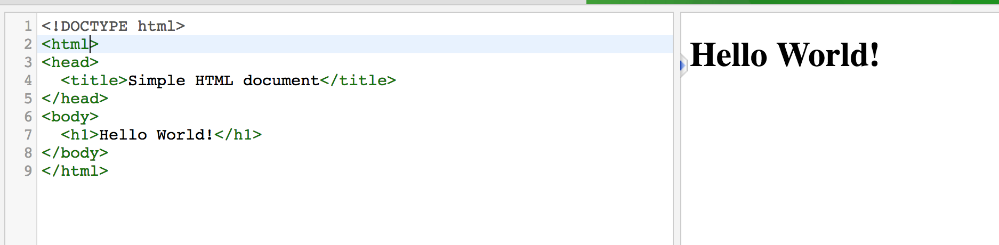
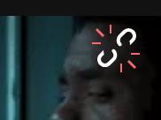

## HTML Exercise: Build a small web page!

[BACK TO MONDAY](https://witny-summer-guild-2018.github.io/)

By knowing how to look up stuff about HTML, you know enough to build a web page!

You'll start by going to [this webpage](https://www.tutorialrepublic.com/codelab.php?topic=html&file=simple-document) where you have a simple HTML starter page, with just this HTML in it:

```
<!DOCTYPE html>
<html lang="en">
<head>
  <title>Simple HTML document</title>
</head>
<body>
  <h1>Hello World!</h1>

</body>
</html>  
```

#### **YOUR GOAL:** Build a small web page about your favorite book / movie / animal / music / artist / sports team...

Whatever you want!

You'll start with that link above, and add HTML in the box on the left so you can see the result of the page you are building on the right hand side!

e.g.



*Reminder:* Click the auto-update button on the HTML display tool in your browser!

#### First

* Pick a new coding partner from your team! You should each make your own website, but you should consider yourselves each other's partner for sharing ideas and helping each other out.

Before you start working on the website...

**CONSIDER TOGETHER:**

* Where, in that existing HTML, in the online tool, are you going to want to ADD more? Try putting a bunch of blank lines where you want to add new code.
  * What happens?
  * Why?

* Read through the suggestions for your web page below.
  * How are you going to put each of those things in?
  * What order will you do them in?
  * What examples will you reference while you figure out how to do these things?
  * (You can do them in any order, but we suggest going through in the order they are listed in.)


We'll discuss this all together a little bit.


#### **Your web page should have:**
* At least 2 headings, one `h1` and one `h2` or `h3` to separate out pieces of the information on the page.

* At least 1 un-ordered / bulletpoint list with some information.

* Space out your text using line breaks or paragraphs -- whatever you want!

* Include a hyperlink to the WiTNY website with the text *Made at WiTNY Summer Guild* -- like this: [Made at WiTNY Summer Guild](http://www1.cuny.edu/sites/women-in-technology/).
  * The URL is: `http://www1.cuny.edu/sites/women-in-technology/`

* Finally, embed a gif in the page with the `id` attribute `first-gif`. (**See below for specific instructions about how to do this!**)

* *Add any other structure or styling you want!*
  * Check out the examples and see if you can model after those!
  * Do you want to add another hyperlink? Another image?
  * Talk to each other, a lot -- most programmers learn almost everything by talking to people they work with and friends. It's too hard to learn on your own!
  * If you have questions about using any HTML tags, or trying to work with colors, let an instructor know and we'll help you out!

* **Download the file onto your computer when you are done** by clicking the little icon that looks like this:  at the top of the page ()

### How to embed a gif in your web page

1. Go to [giphy](https://giphy.com/) -- `giphy.com` -- and search for whatever you want. Cats? Los Angeles Lakers? Black Panther?

2. When you find a gif you want, put your cursor on it, and click on the little paper-clip looking icon, like this:



That will automatically *copy* the link of the gif.

3. Go back to your HTML browser window.

4. Click in the text box, and THEN, either click **Edit -> Paste** in the menu, OR, on your keyboard, hold the **Control** button and hit the **P** button. You should see the link you just copied (something sort of like this  `https://media.giphy.com/media/3oKIPaSkwgwHz5wpZC/giphy.gif` ) appear in the text box.

5. Now you need to write HTML to make the gif show up on the web page -- what's called "rendering" the gif. OK!

Wherever you want the gif to be, write the following little bit of HTML:

```

```

That's all!

Then, that URL you copied and pasted?

Copy it again (highlight it, and go Edit > Copy, or **Control** + the key **C**), and paste it *in-between* the quotation marks in that HTML.

**NOTE:** Instructions that tell you what to click, or what to type, can be super confusing if you've never seen them before! They're ALSO a great thing to get used to that can be really confusing in a CS course -- but as soon as you get used to it, will be no problem. *Don't hesitate to ask us if you find instructions confusing! It's GOOD to figure out that they don't make sense -- that's what CS is all about. And a TA or instructor will help you -- that's what we're here for!*

Remember, `img` tags don't need to have a second tag the way most other HTML tags do, because it's just rendering the image -- not doing anything about *text* on the page, so the tags don't need to go on *both sides of* any text.

There is other stuff you can add into the HTML -- for example, to make it accessible for Screen Readers, software tools that people use on computers if they are blind or can't see the screen well.

OK, almost done --

*We want to identify this picture specifically with what's called an `id` attribute, so later, we could write some code that makes this gif -- have a red border, or disappear when you click a button! (We'll get to that stuff later.)* You'll see more about why this is so cool and important later. For now, you won't see any difference in what the image looks like just because you give it a special ID.

**SO, to do this**, you should edit your HTML so it looks like this (*your URL will be different from this one, of course, because it should be the URL for the gif YOU chose*):


```

```

And done! Check out the output on the right side of the online tool.


Note that you won't see anything representing that `first-gif` id on the page. What you see on the page shouldn't change at all. That `id` is a behind-the-scenes thing for you, the programmer -- so you, or someone else, can do more specific things with the web page you created!

[BACK TO MONDAY](https://witny-summer-guild-2018.github.io/monday)
