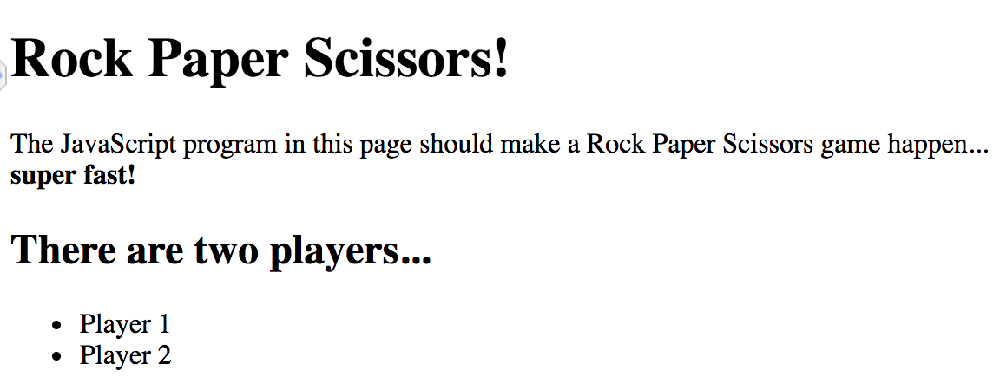

## Rock Paper Scissors - DEBUGGING

The following code is to DEBUG.

Ideally, the page structure should look like this:



And player 2 should win with **scissors** -- an alert should show that happening!

But that's not quite what happens, with the code as is...


```html
<!DOCTYPE html>
<head>
<title>Rock Paper Scissors</title>

  <script>
    var playerOne = "paper";
    var playerTwo = "scissor";

    if (playerOne == "rock" & playerTwo == "scissors") {
        alert("Player One wins - with rock!");
    }
    if (playerOne == "scissors" & playerTwo == "rock") {
          alert("Player Two wins - with rock!");
    }
    if (playerOne == "paper" & playerTwo == "rock") {
        alert("Player One wins - with paper!");
    }
    if (playerOne == "rock" & playerTwo == "paper") {
        alert("Player Two wins - with paper!");
    }
    if (playerOne == "paper" & playerTwo == "scissors") {
        alert("Player Two wins - with scissors!");
    }
    if (playerOne == "scissors" & playerTwo == "paper") {
        alert("Player One wins - with scissors!");
    }
    if (playerOne == playerTwo) {
        alert("It's a tie!");
    }
  </script>
</head>
<body>
    <h1>Rock Paper Scissors!<h1>
    <p>The JavaScript program in this page should make a Rock Paper Scissors game happen... <br><b>super fast!<b></p>

        <h2>There are two players...</h2>

    <ul>
        <li>Player 1</li>
        <li>Player 2</li>
    </ul>
</body>
</html>                            
```

NOTE: When there's an ERROR in JavaScript code, even if you EXPECT something to happen... Sometimes nothing happens, because the website processing the code is freaking out in the background: Oh my gosh, there's an error, can't do anything, oh no!

So it's up to the programmer to figure out what might be wrong by talking, drawing, and problem-solving; making 1 change at a time to see if it fixes the problem.
