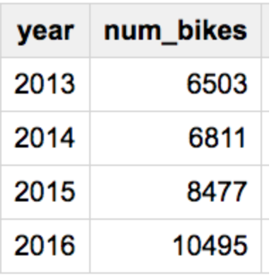

## DAY 2 - Users & Data!

---

[HOME](https://witny-summer-guild-2018.github.io/) |
[TEAM](instructors.md) |
[MONDAY](https://witny-summer-guild-2018.github.io/monday) |
[TUESDAY](https://witny-summer-guild-2018.github.io/tuesday) |
[WEDNESDAY](https://witny-summer-guild-2018.github.io/wednesday) |
[THURSDAY](https://witny-summer-guild-2018.github.io/thursday)

---

Today is a completely different perspective on product development in technology!

We're going to spend this week going through a bunch of the process involved in technology product development. And a big piece of that process -- is about figuring out what the potential users of your product want and need!

So in doing so, you're going to talk to real people in NYC -- here in Times Square -- and then analyze the data you get from them to help you figure out what kind of technology product you want to come up with, as a team!

This is a lot more complicated than it *might* seem at first...

### What's going to happen today

* You'll receive a challenge question
* Dive into the challenge: what does it really mean?
* Building questions - what's a good question?
* Framing questions - how do you ask strangers?
* Go out into Times Square, ask questions and take notes!
* Return for lunch
* Analyze the data you got and add your own transportation thoughts and data
* Gather data to focus on a problem that you'll take to tomorrow!

### First, back to mistakes

* Introductions & coding mistakes review

* T-Shirts! (Both cool fashion + help ID you as a WitNY member when you do user research out in Times Square)

### **YOUR CHALLENGE:**
### *How might we make transportation in New York City better?*

We're going to consider this question in a few different ways today.

### What is "user experience"? (~ 5 min)

* User Experience ("UX") research -- **intercept testing** (today)
* User Experience ("UX") design

### Break apart the challenge - Exercise (~ 1/2 hour)

* **How might we**
  * Not about "can"
  * Not about "will"

* **What does "better" even mean?** What are more specific words for what it could mean?
  * In your team, come up with some things it could mean. For example, "faster for people to get where they want to go"? You should try to be as specific as possible.
  * Write each one on a post-it note and collect them on your table!
  * We're going to share them afterward, so choose a spokesperson from your team to share them!

**As a user researcher:**
* What kind of specific question(s) should you ask?
* What information do you need to know?
* What kind of data is necessary to answer our questions?
* What kind of data can we actually get?

### Building questions (for people)

#### Selecting questions

* Say we wanted to build an app about finding good restaurants in New York City.

Three questions...

  * (A) *How do you usually find a restaurant to eat lunch at?*
  * (B) *Were you excited to come eat lunch in in Times Square today?*
  * (C) *What is your least favorite thing about restaurants in Times Square?*

* Which question do you like best?
* Why?

#### Building new questions - A reference you can check out

[A reference you can check out](building_qs.md)

### Asking & framing questions for "intercept testing"

**Pick your starting role:**

- QUESTION ASKER
- NOTE TAKER

You'll trade off! So don't get too comfortable. You both get to take notes and ask questions!

And we'll be talking a little bit about ways to do each one so you feel comfortable -- this is brand new to everyone (I assume) and kind of intense (at least, I sure think so whenever I do this!).

#### Helpful tricks for approach - a reference

* **Calm approach** - makes it easier for people to be approached
* **Side or front approach** - don't surprise people, make them feel like they can leave if they need to
* **Introduce what you want to do**, and on assent (agreement to participate), do it *right away*, quickly and clearly
* **Explain that you're not asking for money** - people want to know why they're being asked and what they can expect.
* **Give them an extremely brief what and why and time - "Specify the ask"**

**Here's a useful script to start with:**
*We're part of a program called WitNY to get more women involved in technology, and we're doing a project about transportation in NYC. May we take 2 minutes to ask you a couple questions about NYC [transportation/subways/buses/CitiBike/whatever is appropriate for your situation]?*

(Then, if they say yes)

*Thanks!*

Write that script down on your notepad. You'll want to practice it and feel good about reciting it clearly and comfortably.

(It'll get easier the more you do it!)

##### Take 2 minutes -- literally, I'm going to set a timer -- to think about some time(s) you've been approached on the street in New York City or somewhere else.

* What do you find annoying or frustrating about it?

* What do people do that might make you *want* to pause and talk to them?

Keep those things in mind when you ask!

**& in general...**

QUESTION ASKER
-> Say your introduction. If assent,
-> Ask your context question
-> Ask your subject question

NOTE TAKER:
Listen & take notes!

(Don't worry -- there's a specific way. You don't have to be super good at writing or notes or anything.)

#### First: Building your questions - EXERCISE

We'll get to *asking* them and taking *notes* on them in just a minute. First, you need to have something to ask! (Check out **YOUR GOAL** below.)

**With your partner,**

* Come up with 2 questions that the two (or three) of you want to ask, following these guidelines:

  * <u>You need 1 context-gathering question</u>

  * <u>You need 1 "subject" question that will get you an interesting answer</u>

* *Each pair should share their questions with your whole team, quickly.* It's OK if two pairs have the same or similar questions! But it's great to hear others because it can help you think about what you want to ask.

* We'll take five more minutes to solidify your question and get to your goal.

* Instructors will wander and chat with you all about questions!

Flag us down if you want to talk more with us (someone on the team raise your hand, and we'll let you know that we're coming)

#### YOUR GOAL: Each pair should have 1 context question and 1 subject question written down on a notepad that you feel good about!

Make sure you've chatted a little bit to at least 1 instructor or TA about your question so you feel really confident about it.

*Brief discussion...*

### (Notes on) Taking notes on the answers...

* Identify specific ideas
* Write after they talk, if you can (or note after a solid idea has come across)
* Don't try to replicate full sentences (that's usually pretty hard!)
* *For example...*

### In your question pairs

Four minutes!

Practice giving your introduction and asking your questions clearly to one another.

You should each practice saying your full introduction (see script above) and the questions 2 times each.

### Quick notes on intercept testing

* "Putting your researcher hat on" -- you're occupying a role

* Think about standing somewhere after you walk for a while and counting the people who walk by -- and trying to ask e.g. every 4th person (it's not a choice, it's just a pattern) -- of course, you can always alter the pattern (every third person, a person who looks at you with a lot of curiosity...)

* Make sure you switch off the question-asker vs note-taker roles every couple asks -- hand off the pen and notepad to the other person!

* Don't be afraid to ask "Why do you think that is?" if they give you a short answer and you want more detail. If they walk away or say "I don't know" -- that's okay! No loss for you -- but it almost never hurts to try.

* As the note-taker, it's fine to note context clues as well! What does that mean? If you talk to someone who looks like they're in a hurry, you can note that. If, say, they're carrying a lot of bags and they've just put them down, you could note that. Could clue you in to some interesting stuff.

### Let's PRACTICE

* In a couple rounds ...

### Ready, set ...

We'll send you out in pairs, separated by a minute or so. We'll tell you what direction to go!

### TIMES SQUARE!

* Try to approach people, ask questions, and take notes

* Don't worry if you don't get answers or people don't respond -- we'll have lots of opportunity to expand on the data you get later today

* Think of it as a totally low-stakes opportunity to practice talking to new people! You are user researchers, data gatherers, today

  * **Any concerns or questions or need a staff member / help, call: 734-707-1823 to reach Jackie!**

* Head out for 2 hours -- **you should come back here to Microsoft by 1:15 pm for lunch!** Make sure to keep your sign-in ID badge you got in the morning.

### ~ Lunch ~

### Analyzing data from users

* **Organizing your notes & gathering qualitative data**

  * Translate notes to *observation* post-its

* **Affinity Diagramming exercise**

  * A quick example

* **Select problem themes** (

* Summarize the themes you found from your affinity diagrams
* Combine them with issues you've noticed in your observations

### Introduction to qualitative vs quantitative data

* Quant vs Qual - why do we care?

* Data... it means all kinds of things

  * [Visualization of NYC subway data](https://www.citylab.com/transportation/2016/12/visualizing-a-full-day-on-the-new-york-city-subway/510020/)
  * What questions to ask about that?

  * [Entries and exits of NYC subways](http://piratefsh.github.io/mta-maps/public/)
  * What about this? How could this even get made?

  * (Hint: JavaScript is part of it, and data is the other part, PLUS a LOT of time)

  * [And ALL kinds of NYC transit visualization...](https://www.citylab.com/transportation/2017/04/groove-out-to-24-hours-of-new-york-transit-with-the-multimodal-symphony/522633/)

  * Or even a small amount of data in a spreadsheet, that you could make a chart out of:

  

  * Always: What might this tell us?

  * What does this NOT tell us? What questions can we ask?

* (If time) What's this got to do with tech, again? (So many things...)

  * To be a great technologist, you've gotta be asking these questions

  * And that's another reason to be in CS -- YOU will ask a different question AND come up with different answers than someone who has differet experience from you. YOU are invaluable.

### Conclusion

* Exit tickets

### Additional Resources on User interviews
#### (if you're interested in this -- you don't need these now!)
* [https://www.smashingmagazine.com/2014/06/facing-your-fears-approaching-people-for-research/](https://www.smashingmagazine.com/2014/06/facing-your-fears-approaching-people-for-research/)
* Brandon Stanton of Humans of New York: [https://www.huffingtonpost.com/2014/05/01/brandon-stanton-humans-of-new-york_n_5242699.html](https://www.huffingtonpost.com/2014/05/01/brandon-stanton-humans-of-new-york_n_5242699.html)
* [https://uxdesign.cc/asking-the-right-questions-on-user-research-interviews-and-testing-427261742a67](https://uxdesign.cc/asking-the-right-questions-on-user-research-interviews-and-testing-427261742a67) (note that many of these resources refer to much more extended interviews than the question-asking you will be doing here -- however, the suggestions they impart and the tricks they list are still useful!)
* [https://uxknowledgebase.com/user-interview-how-to-ask-good-questions-eb80f8b99627](https://uxknowledgebase.com/user-interview-how-to-ask-good-questions-eb80f8b99627)
